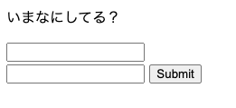
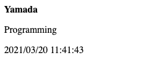

前回は「クエリ文字列」「URLパラメーター」について説明しました。
URLに `?` に続けて文字をつけるとサーバーに送ることができて、この値は `QUERY_STRING` という環境変数で受け取れるということでしたね。

ただ前回のやり方だと2つ問題があります。1つ目は毎回送るときにURLに `?` に続けて文字入力するのが手間な点、2つ目は複数のパラメーターを送ることができない点です。

今回はこの2つの問題をHTMLの「フォーム」を使って解決していきたいと思います。

"HTML" はページの表記方法で、たとえば「この文字が見出し、ここに画像を表示する」ということをブラウザに伝えるものでしたね。
HTMLで決められた見出しや「画像」などの要素は「タグ」で表現します。

今回利用する フォーム "&lt;FORM&gt" タグは、ブラウザからWebサーバーに値を渡すときに使われます。

まずはHTMLをみてみましょう。

```html
<html lang="ja">
    <head>
        <meta charset="utf-8">
    </head>
    <body>
        <p>お名前をいれてください</p>
        <form action="/cgi-bin/07/hello.pl">
            <input type="text" name="yourname">
            <input type="submit">
        </form>
    </body>
</html>
```

FORMタグを使ってこのようなHTMLファイルを作成します。FORMの送信先はactionで指定します。前回使った名前を表示するプログラムを指定しています。
また `text` と `submit` というタグが使われていて、`text` には `yourname` という名前がついているんだなってことが分かりますね。


で次にどんな動きになるかみてみましょう。


HTMLを表示するとこのような画面になります。テキストフィールドが1つと送信ボタンが1つだけのシンプルな画面です。


このテキストフィールドに名前を入れて "Submit" ボタンを押します。


すると前回同様 "Hello" に続けて名前が表示されましたね。

でも少し前回と違い、今回は `yourname=` という文字が表示されています。

もう一度HTMLに戻りましょう。

（上に掲載したHTMLを再度記載）

HTMLのフォームはテキストフィールドに文字が入力され送信ボタンが押されると

（強調： 入力フィールドの名前=入力された値）

という文字列にしてaction先のプログラムに送信します。今回テキストフィールドに `yourname` という名前をつけたので

（強調： yourname=Yamada）

という文字列が送信されたわけですね。

もう一度フォームで名前を送信してみます。


この時URLは

```
http://www.example.co.jp/cgi-bin/07/hello.pl?yourname=Yamada
```

となっています。

さらにHTMLを修正してフィールドも2つにしてみましょう。

```html
<html lang="ja">
    <head>
        <meta charset="utf-8">
    </head>
    <body>
        <p>いまなにしてる？</p>
        <form action="/cgi-bin/07/tweet.pl">
            <input type="text" name="yourname"><br/>
            <input type="text" name="message">
            <input type="submit">
        </form>
    </body>
</html>
```

`message`という名前のフィールドを増やしました。このHTMLを表示してみましょう。



今度はこれの送信先のプログラムを直します。フォームで送信されるときはURLに追加されるクレリ文字列が

（強調： 入力フィールドの名前=入力された値）

となることは説明した通りですが、今回のように複数の値を渡した場合には

（強調： 入力フィールドの名前=入力された値&入力フィールドの名前=入力された値）

と "&" で繋がった文字列になります。

つまりプログラム側では

1. クエリ文字列を環境変数から取り出す
2. "&" で文字列を分轄して、それぞれの入力フィールドを値を得る
3. さらに "=" で分轄して、名前と入力された値を得る

という処理が必要になります。ちょっと難しいかもしれませんのが、実際のコードをみてみましょう。

```perl
#!/usr/bin/env perl

use strict;
use warnings;
use 5.010;

my $q = $ENV{'QUERY_STRING'};
my @fields = split("&", $q);
my %pairs  = {};
for my $field (@fields) {
    my($key, $value) = split("=", $field);
    $pairs{$key} = $value;
}

my ($sec,$min,$hour,$mday,$mon,$year) = localtime;

say("Content-Type: text/html");
say("");
say("<b>", $pairs{'yourname'}, "</b>");
say("<p>", $pairs{'message'}, "</p>");
say("</p>");
printf("<p>%04d/%02d/%02d %02d:%02d:%02d</p>"
	, $year+1900
	, $mon +1
	, $mday, $hour, $min, $sec);
```

1. クエリ文字列を環境変数から取り出す
2. "&" で文字列を分轄して、それぞれの入力フィールドを値を得る
3. さらに "=" で分轄して、名前と入力された値を得る


長いプログラムですがビックリしないでください。ひとつひとつはこれまで出てきた内容のおさらいしながらみていきましょう。

（コードと解説を左右に配置して、ハイライトで強調しながら）

まず `QUERY_STRING` という環境変数からクエリー文字列を取り出しています。
次に "&" で入力フィールドごとに分轄し
さらにそれぞれの入力フィールドを "=" で分轄して名前と入力された値を取り出しています。
現在時刻も入手して、
最後にHTMLに整形したレスポンスボディをHTTPヘッダーとともに出力すれば完成です。

実際の画面の動きをみてみましょう。


HTMLフォームを表示して


名前とメッセージを入力して submit ボタンで送信すると



誰かのつぶやきを表示する画面を作ることができました。

---
今回は長いプログラムがでてきたのでちょっと難しかったかもしれません。
HTMLフォームを使ってWebサーバーにデータを送ることができ、Webサーバーでは受け取ったデータを使って動的コンテンツを表示できることが分かってもらえたいでしょうか。

これをどんどん10倍、100倍、1000倍！改良していくことで、掲示板やツイッターみたいなWebサービスが実現できるわけですね
