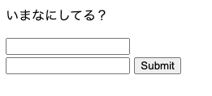
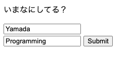
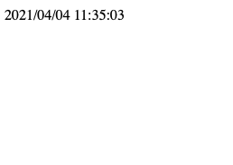
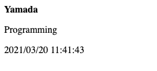
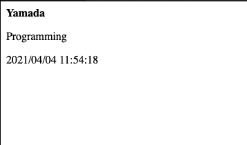

前回はHTMLフォームを紹介しました。

1. HTMLフォームを使うとWebサーバーにデータを送ることができる
2. 複数の値を渡す際に名前で区別することができる

HTMLフォームを使うとWebサーバーにデータを送ることができて、それぞれの値には名前がつくのでプログラム側では区別して扱うことができる、ということでしたね。

今回はWebサーバーへのデータの渡し方の方法をもう一つ紹介したいと思います。

POST

という命令です。

第4回で説明しましたが、ブラウザにURLを指定してページを表示するときには「GET」という命令が使われます。
そしてGET命令はクエリ文字列を使うことでWebサーバーに値を渡すことができる、というのはこれまでの内容でした。

ただ、このクエリ文字列を使った方法にはいくつか問題があります

1. URLに値がそのまま渡されてしまう
2. とても長い文字列を渡すことができない
3. 文字列しか渡すことができない

1は例えばパスワードなんかもそのままURLに含めて渡されてしまうってことです。通信経路で筒抜けになってしまうのは非常に良くないですね。
2と3はクエリ文字列の方法では、例えば画像ファイルなどをWebサーバーに渡すことができないということです。

この問題を解決するためにGETでなくPOSTという命令を使います。

----
それでは実際にPOSTでデータを送る方法をみていきます。
まずは前回のHTMLをおさらいしてみましょう。

```html
  <html lang="ja">
      <head>
          <meta charset="utf-8">
      </head>
      <body>
          <p>いまなにしてる？</p>
          <form action="/cgi-bin/tweet.pl">
              <input type="text" name="yourname"><br/>
              <input type="text" name="message">
              <input type="submit">
          </form>
      </body>
  </html>
```

注目してもらいたいのはFORMタグです。ここでは action として値を渡すプログラムのみ指定しています。ここで新しく "method" （メソッド）という属性を追加し値に "POST" と指定します。

```html
  <html lang="ja">
      <head>
          <meta charset="utf-8">
      </head>
      <body>
          <p>いまなにしてる？</p>
          <form action="/cgi-bin/tweet.pl" method="POST">
              <input type="text" name="yourname"><br/>
              <input type="text" name="message">
              <input type="submit">
          </form>
      </body>
  </html>
```

HTML側の変更はこれだけです。
簡単ですね。

ではこのHTMLをブラウザで表示してみましょう。



methodの指定しか変えていないので見た目はまったく変わっていません。

名前とメッセージを入力して



submit ボタンで送信すると



あれ名前やメッセージが表示されていませんね。

前回の結果と見比べてみましょう。



Submitボタンを押したあとのURLをみてみるとこのようになっています。

http://www.example.co.jp/cgi-bin/tweet.pl

GETの時と違ってクエリ文字列が付与されていません。クエリ文字列が付与されないので、環境変数 QUERY_STRING にも文字が渡されず、そのためプログラム側で名前とメッセージを受け取ることができなかったわけです。

POSTメソッドの時はクエリ文字列とは異なる方法でWebサーバーに値が渡されます。
それはどこかというと「リクエストボディ」として渡されます。

これも第4回で説明しましたが、HTTPではブラウザとWebサーバの間を「リクエスト」と「レスポンス」でやりとりしていて、リクエスト・レスポンスはそれぞれ「ヘッダー」と「ボディ」で構成されています。
GETのときは「このページを表示したい」というリクエストヘッダーだけでボディは空でしたが、POSTのときはWebサーバーに渡す値が含まれる、というわけですね。

それではリクエストボディで渡された値を受け取れるようにプログラム側を書き換えます。これは実際のプログラムをみてもらいながら説明します。

```perl
#!/usr/bin/env perl

use strict;
use warnings;
use 5.010;

my $q;
read(STDIN, $q, $ENV{'CONTENT_LENGTH'});
my @fields = split("&", $q);
my %pairs  = {};
for my $field (@fields) {
    my($key, $value) = split("=", $field);
    $pairs{$key} = $value;
}

my ($sec,$min,$hour,$mday,$mon,$year) = localtime;


say("Content-Type: text/html");
say("");
say("<b>", $pairs{'yourname'}, "</b>");
say("<p>", $pairs{'message'}, "</p>");
say("</p>");
printf("<p>%04d/%02d/%02d %02d:%02d:%02d</p>"
	, $year+1900
	, $mon +1
	, $mday, $hour, $min, $sec);
```

実は前回と変わっているのは7行目と8行目の2箇所だけです。
環境変数 QUERY_STRING から値をとるのではなく "STDIN" で表されている「標準入力」というところから値を受け取っています。

ここでは「標準入力」がなにかは気にしないでください。HTTPのリクエストボディは標準入力としてプログラムに渡されて read というコマンドで受け取ることができるんだな、ということがわかればOKです。

それでは改めてフォームに値を入力してPOSTしてみましょう。



値の受け取り方法を変えただけなので出力結果も前回と変わりません。

今回はFORMのmethodをGETからPOSTに変えて、値をWebサーバーに送るという方法を紹介しました。

説明中にみたようにPOSTだとクエリ文字列に値は表示されないのでパスワードなども渡すことができます。

（注意として下記を記載してほしい！）
> リクエストボディを除くことができればパスワードを盗み見ることもできるのでPOSTだから安全ということではありません。
HTTPSを使った暗号化が必要になりますが今回は省略します。

また今回は取り上げませんでしたが、さらにもうひと工夫をすれば画像や動画といったテキストファイル以外もフォームでアップロードすることができます。

----
さてここまで8回に渡って、
- ブラウザとWebサーバー
- DNSとIPアドレス
- HTTPとGETとPOST
- 動的コンテンツ
といった仕組みを紹介してきました。

ここまでの知識を足がかりに、いまインターネットで使われている技術の多くを理解できるようになります。

