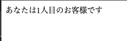

きょうは前回までの内容を振り返りつつ、システムエンジニアがどんな仕事をしているか紹介します。

今回取り上げるのは「訪問者カウンター」インターネット黎明期に個人ホームページに設置されてた「あなたはXXXXX人目のお客様です」ってアレです。

ではさっそくこの仕組の流れを紹介していきます。

1. ブラウザでURLで指定したホームページをリクエストします。 http://www.example.co.jp/
2. このサイトの「デフォルトドキュメント」は index.pl とされています。これは動的コンテンツの扱いとなっています。
3. index.pl は現在のカウント数をカウンターファイルから読み込みます。
4. HTMLで「あなたはXXXXX人目のお客様です」と整形してレスポンスを返します。
5. カウント数に + 1 してカウンターファイルに上書き保存します。
6. ブラウザは返ってきたHTMLを表示します。

これまで説明してきたので流れはわかるんじゃないでしょうか。

「デフォルトドキュメント」という初めての言葉がでてきています。
これは今回のURLのようにファイル名を指定してしない場合にWebサーバーが返すファイル名のことです。

さてコードをみてみましょう。

```perl
#!/usr/bin/env perl

use strict;
use warnings;
use 5.010;
use FindBin;
use Fcntl qw(:flock);

my $filename = $FindBin::Bin . "/../count.txt";
my $count = 0;

open my $fh,"+<",$filename or die($!);
while(<$fh>){ $count = $_; }
$count += 1;
seek $fh, 0, 0;
truncate $fh, 0;
print $fh $count;
close($fh);

say("Content-Type: text/html; charset=utf-8");
say("");
say("あなたは", $count, "人目のお客様です");
```

コードの細かい動きは知る必要ないですが、順に説明していきます。

まず count.txt というファイルを用意します。
このファイルを開いてカウント数を読み込みます。
カウントに1追加します。
ファイルの一番最初に書き込み位置を設定して
一度ファイルの内容を消し
カウント数をファイルに出力します
最後にHTTPヘッダーとともに結果を出力します。

実際にこのページを何度か表示してみましょう。




良さそうですね。

はい、これでおしまい、、、、、という話ではありません。
実はこのプログラムには大きな不具合が潜んでいます。

いったんファイルに保存されたカウント数をゼロにリセットします。

その上で、今度は同時に3つから計100回このページを表示してみましょう。
今回はApacheというWebサーバーに同梱されている `ab` （あぱっちべんち）というプログラムを使います。
次のコマンドを実行します。

```
$ ab -c 3 -n 100 http://www.example.co.jp/
```

さて、ではもう一度ブラウザでページを確認してみましょう。先ほど100回アクセスしてるので次は101人目になるはずですね。


あれ5人目になっています。つまり先ほど100回アクセスしたのに4つしかカウントが増えていなかったわけですね。

これは「排他制御」が行われていないためです。
3つ同時にアクセスしたときに、それぞれがカウンターファイルを読み書きしてしまうため、たとえばある処理がファイルの中身を消したタイミングで別の処理がファイルを読むとカウンタは0になってしまうわけです。

これを直すには排他制御を行います。つまりいずれかの処理がファイルを読み書きしている間は、他の処理は利用できなくするわけです。
今回はファイルを開いたあとにロック（flock）を行います。

```perl
open my $fh,"+<",$filename or die($!);
flock $fh, LOCK_EX or die "Unable to lock file $!";
while(<$fh>){ $count = $_; }
$count += 1;
seek $fh, 0, 0;
truncate $fh, 0;
print $fh $count;
close($fh);
```

この1行を入れるとロックが獲得できるまで処理は進みません。そしてロックを獲得するのは1つのみなので、これ以降の読み書きは正しく行うことができます。


さて、これで十分でしょうか？今回のような単純な訪問カウンターではこれで十分かもしれません。

でももしこのホームページが世界的に注目されているゲーム機の予約ページだったらどうでしょう？そして扱っている数字が訪問カウンターではなく在庫数だったらどうでしょう？
今回の仕組みだと誰かがホームページに訪れ、商品を購入し、在庫が減るまで他の人はずっと待機していなければいけません。
それこそ何万人、何十万人の人が訪れる予約サイトだとこの仕組みではさばききれないようです。

では次のような仕組みはどうでしょう？読み取りと書き込みの処理を分けて、書き込みのときにだけ排他制御をかける方法です。
ページをみた段階ではまだ在庫があったけど、実際に購入するタイミングで「おっと誰かが先に購入してしまったようだ」となるわけです。
例えばドラゴンクエスト10のバザーはこういう仕組みになっています。

ただ同じ方法が新幹線の座席予約だったらどうでしょう？号車と座席が空いたので予約手続きを進めて、いざ確定しようとしたら「すでに座席が取られてました」だと困ってしまいます。
この場合はまだ注文が確定していなくても、誰かが予約を開始しているようなら「空席なし」としておいた方が良さそうです。

ｐ
つまり「どこまで同時処理を許すか」は扱う商品によって考えなければいけません。この方法が唯一正しいということはありません。

システムエンジニアはこういった点も考えながら仕組みを作っていくんです。おわかりいただけたでしょうか？


