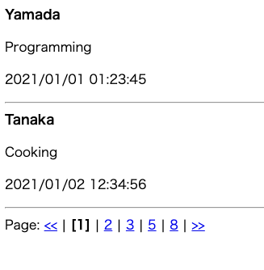

今回取り上げるのは「掲示板」です。前回の訪問者カウンターと同様にインターネット黎明期に個人ホームページに設置されてました。

「キリ番ゲットした人は掲示板で報告お願いします」は定番でした

前回のカウンターはブラウザから渡される情報はなく、アクセスするたびにカウンターがあがっていくものでした。
今回の掲示板はHTMLフォームを使ってメッセージをWebサーバーに送ります。

掲示板もどきは#7でも取り上げましたが、前回はデータの保存をしていませんでした。
ブラウザからPOSTされたメッセージをそのまま表示していただけなので、過去の投稿メッセージを表示できませんし、他の人のメッセージを読むこともできません。
今回はメッセージをファイルに保存してみましょう。

ではさっそくこの仕組の流れを紹介していきます。

1. ブラウザでURLで指定したホームページをリクエスト(GET)します。 http://www.example.co.jp/form.html
2. 投稿フォームが表示されるので、メッセージを入力して送信(POST)します。http://www.example.co.jp/bbs.pl
3. post.pl は受け取ったメッセージをデータファイルに追記します。
4. 書き込まれたデータファイルを読み込み、メッセージ一覧をHTMLに整形してレスポンスを返します。
5. ブラウザは返ってきたHTMLを表示します。

メッセージはPOSTメソッドを使ってWebサーバーに送ります。POSTメソッドのときはリクエストボディでフォームのデータが送られるんでしたね。
ページを「参照」する時にはGET、データを送って「変更」する時にはPOSTを使う、と覚えておくと良いです。

## CSVについて

書き込むデータは次のような形式にしました。メッセージ番号、書き込み日時、名前、メッセージをカンマで区切ります。

```csv
1,2021/01/01 01:23:45,yamada,Programming
2,2021/01/02 12:34:56,tanaka,Cooking
```

カンマ区切りのデータをCSV(Comma-Separated Values)といい、データをやりとりする際にはよく使われます。
このCSVファイルを読み込んで、カンマで各項目を分轄して名前やメッセージを取り出す方法は(#7)でのデータの取り扱いを応用して作ります。

またメッセージ番号は前回(#9)の訪問者カウンターの応用すればできそうですね。

さて、これで掲示板ができました。とはなりません、今回もいろいろ使っていると問題がみつかります。

## 改行を特別扱いする

### 問題
メッセージを投稿するHTMLフォームをみてみましょう。メッセージは複数行書けるようになっていますね。
ここで鈴木さんがテレビをみながらツイートしてるとしましょう。フォームに2行入力して送信を押します。
するとデータファイルはどうなるでしょう？

```csv
1,2021/01/01 01:23:45,Yamada,Programming
2,2021/01/02 12:34:56,Tanaka,Cooking
3,2021/01/03 01:01:01,Suzuki,Watching TV
Tweeting
```

CSVの最初がメッセージ番号じゃなく "Tweeting" というメッセージになってしましました。
このままもし4つ目の書き込みがされると、正しくデータが読み込めない、つまりデータが壊れてしまいますね。

### 解決方法
改行をそのままCSVファイルに書き込むのは良くないことがわかったので、改行を別の文字、たとえばシャープ3つに直して書き込むことにするのはどうでしょう。

```csv
1,2021/01/01 01:23:45,Yamada,Programming
2,2021/01/02 12:34:56,Tanaka,Cooking
3,2021/01/03 01:01:01,Suzuki,Watching TV###Tweeting
```

誰かが掲示板にアクセスしてCSVファイルが読み込まれたときには、このシャープ3つを元の改行に戻して画面に表示するわけです。

これを文字列の「エスケープ処理」といいます。今回の改行のように特別な文字を別の文字で置き換える処理をこういいます。

でも今度はメッセージにシャープ3つを入力してはいけないことになってしまいましたね。なにかいい方法はないでしょうか。
もし特別な文字を気にせず、こんなやり方でデータの登録ができたら便利そうじゃありませんか？

```
投稿者が "Yamada"、メッセージが Programming、投稿日時を現在時刻にして CSVファイル に挿入する
```

英語っぽく書いてみましょう。

```
user = "Yamada", message = "Programming", posted_at = NOW() INSERT INTO csvfile
```
英語は述語が最初にくるので、さらにこんな感じで
```
INSERT INTO csvfile (user, message, posted_at) VALUES ("Yamada", "Programming", NOW())
```


## メッセージのページ送りを実装する
### 問題
もしこの掲示板が人気がでて書き込みが1000件、2000件、1万件と増えていったとします。

訪問者はこの掲示板を表示するたびに毎回1万件ものメッセージが表示されるのを待たないといけないですね。
1つのメッセージを表示するのに1ミリ秒かかるとすると、毎回10秒も待たないといけません。

### 解決方法
掲示板を表示するときにメッセージを100件ずつ分轄表示してみましょう。



画面の下に表示されているリンクをクリックすると、クエリ文字列を使ってページ番号が渡されるようにしてみましょう。

1ページ目 ... http://www.example.co.jp/bbs.pl?page=1
2ページ目 ... http://www.example.co.jp/bbs.pl?page=2

1ページ目ならCSVファイルの1行目〜100行目、2ページ目なら101行目〜200行目、、、といったように分轄して表示すれば良さそうですね。

ところでこのCSVファイルからデータを取る時に、次のようなデータの取り方ができたら便利そうじゃありませんか？

```
1 行目から 最大100行のメッセージをCSVファイルから選択する
```

英語っぽく書いてみましょう。

```
OFFSET 1 LIMIT 100 SELECT user, message, posted_at FROM csvfile
```

これも述語が最初にしてみましょう
```
SELECT user, message, posted_at FROM csvfile OFFSET 1 LIMIT 100
```

## 不適切なメッセージを削除する
### 問題
大変です。掲示板が悪用されておかしな書き込みがされてしまいました。
このままでは掲示板利用者に迷惑がかかるので不適切なメッセージは削除してしまいましょう。

幸い不適切なメッセージの番号が分かっているので、この書き込みだけを消せば良さそうです。

ただそうこうしている間にも掲示板には新しいメッセージが書き込まれています。ちゃんと「排他制御」を行ないつつメッセージを削除しないとCSVファイルが壊れてしまうかもしれません。

こんなとき、次のようなコマンドでデータを削除できたら便利ですよね。

```
CSVファイルからメッセージ番号が 1234 番目のメッセージを削除する。
```

これも英語っぽく書いてみましょう。

```
DELETE FROM csvfile WHERE message_no = 1234
```

このDELETE処理の前後で排他制御がされていれば、ファイルを壊さずに不適切なメッセージは削除することができそうですね。

## まとめ

今回は掲示板を題材にシステムの機能を取り上げてみました。
最初CSVというカンマ区切りの簡易なデータファイルでメッセージを保存していましたが、いろいろな問題がみつかりました。

1. 文字列の取り扱い
2. たくさんのメッセージの一部だけ取り出す
3. 排他制御

そのため INSERT, SELECT, DELETE という命令でメッセージの読み書きができる仕組みを取り上げました。
実際にこの処理を行うシステムを「データベース」といいます。

今回は掲示板の問題点を取り上げつつ、データベースの簡単な紹介を行いました。

世の中で使われている有名なデータベースはMySQL（マイエスキューエル）やOracle（オラクル）、PostgreSQL（ポストグレス）です。
もしネットや本でこういう言葉を見かけたら「データを読み書きするための仕組みなんだな」と思ってください。


本格的なWebシステムを作るときにはこのデータベースの知識が必要になってきます。
データベースだけでも一つの専門領域となっている分野なので興味があればぜひ深く学んでみてください。

- [IPA 独立行政法人 情報処理推進機構：制度の概要：データベーススペシャリスト試験](https://www.jitec.ipa.go.jp/1_11seido/db.html)